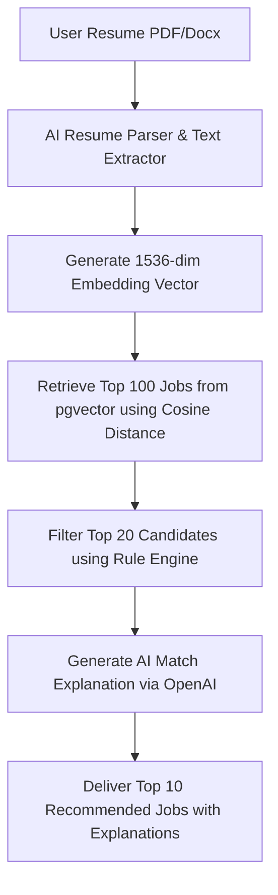

# AI-Powered Job Discovery SaaS

A production-grade, highly scalable (100,000+ users) AI Job Discovery SaaS designed to match candidates to relevant technical jobs using hybrid vector embeddings similarity and customizable filtering rules.

---

## Tech Stack

- **Frontend**: Next.js 15 (App Router), TypeScript, TailwindCSS, Framer Motion, Lucide icons.
- **Backend**: FastAPI (Python 3.12), SQLAlchemy 2.0 (Asyncpg), Celery task runners.
- **Database & Storage**: PostgreSQL (with `pgvector` for embedding searches), Redis (rate limiting & Celery broker), Supabase storage.
- **AI Integrations**: OpenAI GPT-4o-mini (Resume parsing, match reviews, cover letter/outreach drafting) and `text-embedding-3-small` (1536-dimensional profile vectors).

---

## Directory Structure

```text
/
├── backend/
│   ├── app/
│   │   ├── api/             # API Router endpoints
│   │   ├── core/            # Configuration, security, logging
│   │   ├── db/              # Database pool connection and session
│   │   ├── models/          # Declarative SQLAlchemy models
│   │   ├── schemas/         # Pydantic validation schemas
│   │   ├── repositories/    # Database CRUD wrappers
│   │   ├── services/        # Matching, Parsing, Scraping logic
│   │   └── utils/           # Parser utilities & storage managers
│   ├── tests/               # Pytest async unit tests
│   ├── Dockerfile
│   └── requirements.txt
├── frontend/
│   ├── src/
│   │   ├── app/             # Next.js App Router pages
│   │   ├── components/      # Glassmorphic UI layout components
│   │   ├── lib/             # API client wrappers
│   └── Dockerfile
├── docker-compose.yml
├── .env                     # Local environment variables
└── README.md
```

---

## Core Match Architecture

The recommendation pipeline runs in a hybrid structure:



1. **Retrieval (pgvector)**: Runs a cosine similarity calculation comparing candidate resume vectors with jobs table vectors.
2. **Filtering (Rule Engine)**: Filters jobs matching location, remote preferences, min salary thresholds, company exclusions, and decays scores using a freshness timestamp decay check.
3. **Explaining (OpenAI)**: Evaluates the remaining top candidates to construct natural language descriptions detailing match compatibility.

---

## Installation & Setup

Ensure you have [Docker](https://www.docker.com/) and Docker Compose installed.

### 1. Configure Environment Variables
Copy the template configuration to `.env`:
```bash
cp .env.example .env
```
Fill in your `OPENAI_API_KEY`, and optional Google OAuth or Supabase credentials.

### 2. Launch Services
Run the following orchestrator command:
```bash
docker-compose up --build
```
This builds and launches:
- **Postgres Database** (port `5432` with pgvector enabled)
- **Redis Broker** (port `6379`)
- **FastAPI Backend API** (port `8000`, docs available at `http://localhost:8000/docs`)
- **Celery Worker** (handles asynchronous job digests)
- **Next.js 15 App** (port `3000`, access panel at `http://localhost:3000`)

---

## Backend Unit Testing
To run the Pytest checks, enter the backend container or execute locally:
```bash
cd backend
pip install -r requirements.txt
pytest
```
