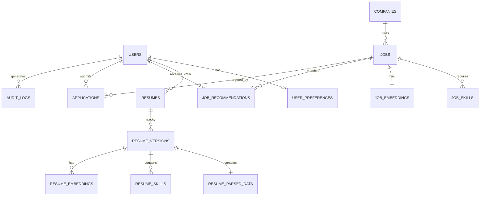

# Implementation Plan: AI-Powered Job Discovery SaaS

This document outlines the architecture, database design, directory structure, and step-by-step roadmap for building the production-grade AI-powered Job Discovery SaaS.

---

## 1. System Architecture & Folder Structure

We will adopt a Clean Architecture for the backend (FastAPI) and a modular page-router or App Router structure for the frontend (Next.js 15).

### Proposed Directory Layout

```text
/
├── backend/
│   ├── app/
│   │   ├── api/             # API Router, endpoints, dependency injection
│   │   │   ├── v1/
│   │   │   └── deps.py
│   │   ├── core/            # Configuration, security (JWT, hashing), logging
│   │   ├── db/              # Database session, base model
│   │   ├── models/          # SQLAlchemy SQL models
│   │   ├── schemas/         # Pydantic validation schemas
│   │   ├── repositories/    # Data access layer (encapsulating SQLAlchemy)
│   │   ├── services/        # Business logic (Matching, Parsers, Scrapers)
│   │   ├── utils/           # Helper functions (text parsing, calculations)
│   │   └── main.py          # FastAPI application entrypoint
│   ├── tests/               # Unit, integration, and API tests
│   ├── Dockerfile
│   ├── requirements.txt
│   └── alembic/             # Database migrations
├── frontend/
│   ├── src/
│   │   ├── app/             # Next.js App Router pages
│   │   ├── components/      # UI components (ShadCN, Framer Motion)
│   │   ├── hooks/           # Custom React hooks (React Query)
│   │   ├── lib/             # API client, utility functions
│   │   ├── types/           # TypeScript interfaces
│   │   └── styles/          # TailwindCSS configuration
│   ├── tailwind.config.js
│   ├── package.json
│   └── Dockerfile
├── docker/
│   ├── postgres/            # Postgres & pgvector init scripts
│   └── redis/               # Redis config
├── docker-compose.yml
└── README.md
```

---

## 2. Database Schema (PostgreSQL + pgvector)

The database will store rich profiles, resume revisions, embeddings, job collections, and matchmaking metrics. Below is the relational mapping:



---

## 3. Development Phases

### Phase 1: Database & Backend Core Configuration
- Setup PostgreSQL with pgvector, Redis, and SQLAlchemy.
- Create migration scripts using Alembic.
- Set up JWT Authentication, refresh tokens, Google OAuth endpoints, and Role-Based Access Control (RBAC).

### Phase 2: Resume Parser & Embeddings Engine
- Build file upload handlers with Supabase storage integration.
- Implement OpenAI-based parser for PDF/DOCX to extract skills, experience, and education.
- Implement resume scoring (Quality & ATS scores).
- Generate embeddings using OpenAI `text-embedding-3-small` (1536-dim) and store in `resume_embeddings` via pgvector.

### Phase 3: Job Aggregation & Normalization Engine
- Build scrapers/aggregators for RemoteOK, Arbeitnow, Adzuna, Greenhouse, and Lever APIs.
- Implement AI-driven job deduplication and normalization (mapping raw job titles and companies to standardized records).
- Generate and store job embeddings.

### Phase 4: Matching & Rule Engine
- Build the Hybrid Recommendation pipeline:
  1. Vector search query on `job_embeddings` utilizing cosine similarity.
  2. Filter top 100 candidate jobs.
  3. Apply Rule Engine scoring (weighting skill overlaps, salary compatibility, remote/on-site choice, experience match, freshness).
  4. Pass top 20 candidate matches to OpenAI for dynamic matchmaking explanations.
  5. Return top 10 recommended jobs.

### Phase 5: Application & Cover Letter Engine
- Implement stateful Application Tracker (Applied, Interview, Rejected, Offer).
- Generate tailored cover letters and HR outreach emails using LLM prompts contextualized to the target job and resume.

### Phase 6: Frontend Pages (Next.js 15)
- Implement state-of-the-art UI with responsive dark/light mode, smooth animations, and glassmorphic dashboards.
- Pages: Landing, Pricing, About, Auth, Dashboard, Resume Upload/History, Recommended/Saved Jobs, Applications Tracker, Interview Tracker, Notifications, Settings, Admin Dashboard.

### Phase 7: Dockerization & Orchestration
- Build optimized production-ready Dockerfiles for Next.js, FastAPI, and Compose configurations.
- Add Redis-based rate limiting and celery workers for task queues (jobs aggregation, daily digest digests).

---

## 4. Key Questions & Design Decisions

To ensure a true production-grade build, please review and confirm the following:
1. **Google OAuth Client Credentials**: Should we pre-configure placeholders, or do you have client IDs to insert?
2. **Supabase/S3 Storage Integration**: Will you use Supabase storage APIs directly, or should we use standard S3 client libraries?
3. **n8n Workflow integration**: n8n workflows will trigger webhook endpoints on the FastAPI backend for jobs aggregation. Should we construct the JSON schema for these webhooks first?
